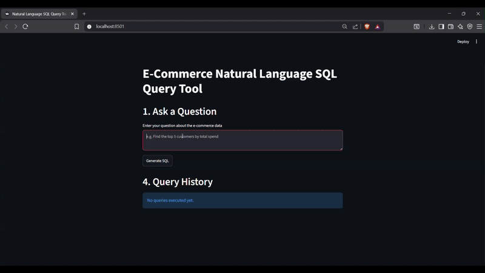

# Natural Language to SQL

A Streamlit application that converts natural language questions into SQL queries using Google's Gemini model and executes them on a SQLite database.

The project demonstrates how Large Language Models can simplify database interaction by allowing users to retrieve information without writing SQL manually.

---

## Demo



---

## Why I built this

Writing SQL can be challenging for users who are unfamiliar with database query languages. I built this project to explore how Large Language Models can bridge that gap by translating natural language into executable SQL while keeping the generated queries transparent and reviewable before execution.

---

## Features

- Natural language to SQL conversion using Google Gemini
- SQLite database with realistic e-commerce sample data
- Automatic SQL generation
- Display generated SQL before execution
- Read-only query validation for safe execution
- Execute SQL and display results in a tabular format
- Query history for previous requests
- Error handling for invalid queries and database exceptions

---

## Tech Stack

| Component | Technology |
|-----------|------------|
| Language | Python |
| UI | Streamlit |
| LLM | Google Gemini |
| Database | SQLite |
| Data Handling | Pandas |
| Environment Variables | python-dotenv |

---

## Workflow

```
User Question
      │
      ▼
Google Gemini
      │
      ▼
Generate SQL
      │
      ▼
SQL Validation
(Read-only Check)
      │
      ▼
SQLite Database
      │
      ▼
Query Results
```

---

## Installation

Clone the repository

```bash
git clone https://github.com/sahishnutsa/nl-to-sql.git
cd nl-to-sql
```

Install dependencies

```bash
pip install -r requirements.txt
```

Create a `.env` file

```text
GEMINI_API_KEY=your_api_key_here
```

Run the application

```bash
streamlit run app.py
```

---

## Example Queries

- List all customers.
- Show products that are out of stock.
- Show all orders placed in the last 30 days.
- Find the top 5 customers by total spending.
- Show the revenue generated by each city.
- List customers who have never placed an order.

---

## Project Structure

```
.
├── app.py
├── database.py
├── llm.py
├── requirements.txt
├── README.md
```

---

## Future Improvements

- Support multiple SQL databases (PostgreSQL, MySQL)
- Query explanation alongside generated SQL
- Visualization of query results
- User authentication
- Chat history persistence
- Schema upload for custom databases

---